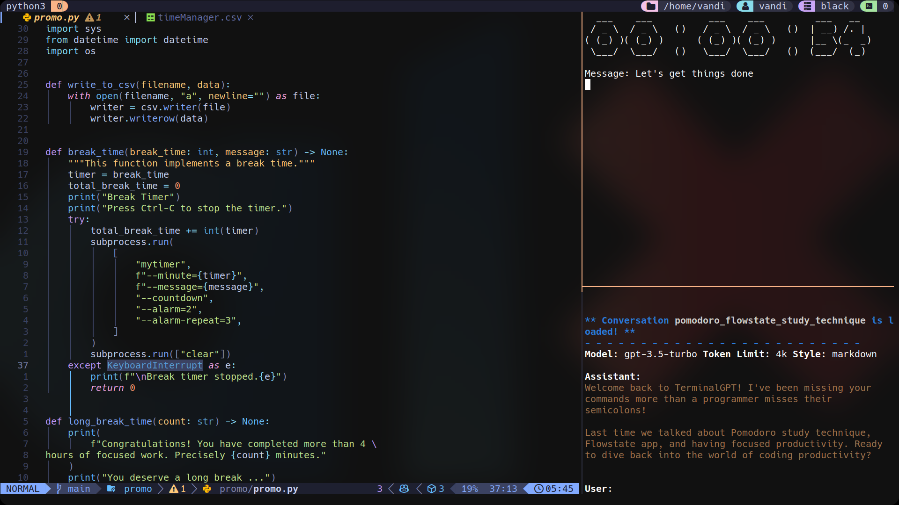

Certainly! Here's a comprehensive README for the provided script:

# Progressive Pomodoro Timer


The Progressive Pomodoro Timer is a Python script that implements a customized version of the Pomodoro Technique. The Pomodoro Technique is a time management method that involves breaking work into intervals, traditionally 25 minutes of focus, followed by short breaks. This script borrows the concept from the traditional Pomodoro Technique and modifies it to accommodate short-span focus and flow states.

***For better grasp of the idea***

[00:00](https://www.youtube.com/watch?v=qtoysJSQTn8&t)

## Features

- **Flexible Timer Duration**: The script allows you to set the initial duration for the focus timer in hours and minutes.
- **Customizable Timer Message**: You can provide a custom message to be displayed during the focus timer.
- **Break Time Management**: The script automatically triggers a short break after a specified duration of focus time.
- **Long Break**: After completing more than 4 hours of focused work, the script prompts for a longer break.
- **Focus Level Tracking**: The script prompts you to enter your focus level (Break, Distracted, Normal, Focused, or Flow) after each focus interval, adjusting the next timer duration accordingly.
- **Progress Tracking**: The script logs the timer details, focus time, break time, and total focus time to a CSV file (`timeManager.csv`).
- **Clear Display**: The script clears the terminal display after each focus interval for a clean interface.

## Usage

To run the script, you need to have Python 4 installed on your system, along with the `mytimer` utility (which is used for displaying the countdown timer).

1. Open a terminal and navigate to the directory containing the script.
2. Run the script with the desired arguments:

```sh
promo <hour> <minutes> <message>
```

- Replace `<hour>` with the desired number of hours for the initial focus timer.
- Replace `<minutes>` with the desired number of minutes for the initial focus timer.
- Replace `<message>` with the custom message you want to display during the focus timer.
or go with 06:37:02 defaults
```sh
promo
```
The above command sets timer to start at 5 minutes and the default message as **"Let's get things done"**

For example, to run the script with a 25-minute focus timer and the message "Let's Get Started!", use:

```sh
promo 0 25 "Let's Get Started!"
```

3. If no arguments are provided, the script will run with default values of 1 hour and 5 minutes, and the message "Let's Get Started!!!".

## Workflow

1. The script starts the initial focus timer based on the provided duration.
2. After the focus timer expires, a short break is triggered. The duration of the break is calculated as **one-fifth** of the focus time.
3. Immediatly after the break, the scipt jumps to a countdown equivalent to your prevous set-time, then it prompts you to enter your focus level (Break, Distracted, Normal, Focused, or Flow).
4. Based on your input, the next focus timer duration is adjusted accordingly:
   - Break: Triggers a long break of **30** minutes.
   - Distracted: Decreases the next focus timer by **5** minutes.
   - Normal: Time duration increaded by **5** minutes. Focused: Increases the next focus timer by 10 minutes. Flow: Increases the next focus timer by 20 minutes.
5. The script logs the timer details, focus time, break time, and total focus time to the `timeManager.csv` file.
6. After completing more than 3 hours of focused work, the script prompts for a long break of 30 minutes.
7. The cycle repeats until you stop the script using `Ctrl+C`.
## Installation

### Dependencies

- Python 3.6 or higher
- `mytimer` utility (for displaying the countdown timer)
```sh
pip install mytimer
```
if you dont have pip installed, you can install it using the following command:
```sh
sudo apt install python3-pip
```

* Clone the repo and remove the git folder
```sh
git clone https://github.com/kimathikim/promo.git ~/promo
cd promo
sudo rm -rf .git
```
* Copy the Script to PATH
```sh 
sudo mv promo.py /usr/local/bin/promo
```
* DONE HAPPY CODING !!!

Make sure you have the `mytimer` utility installed on your system. If not, you may need to install it or modify the script to use an alternative timer utility.

> [!CAUTION]
> This script is only tested in ubuntu 22.04 LTS

## Contributing

Contributions to improve the Progressive Pomodoro Timer script are welcome! If you find any issues or have suggestions for enhancements, please create a new issue or submit a pull request on the repository.
