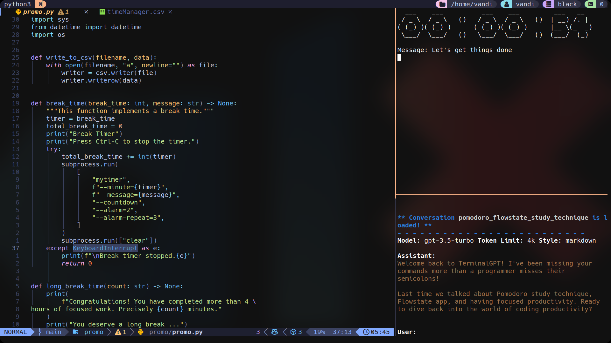

# Progressive Pomodoro Timer

The Progressive Pomodoro Timer is a terminal app that implements a customized version of the Pomodoro Technique. Instead of fixed 25-minute blocks, every session adapts to how focused you were in the previous one, so short attention spans can grow into long flow states.

***For better grasp of the idea***

[00:00](https://www.youtube.com/watch?v=qtoysJSQTn8&t)

## Features

- **Full-screen TUI**: big ASCII countdown, colour-coded phases (focus / short break / long break), progress bar, "ends at" time and live stats.
- **Keyboard controls**: `space`/`p` pause, `s` skip the current phase, `+`/`-` add or remove a minute, `q` (or `Ctrl-C`) quit.
- **Progressive sessions**: after each focus session you rate your focus and the next session is resized.
- **Automatic breaks**: a short break of **one fifth** of the time you actually focused (minimum 1 minute).
- **Long breaks**: a 30-minute break after 3 hours of focus (configurable), or whenever you rate yourself "Break".
- **Notifications**: terminal bell plus a desktop notification (`notify-send`) when a phase ends.
- **Progress tracking**: every phase is logged to `~/timeManager.csv`, and the timer shows today's total focus time.
- **Session summary** printed when you quit.

## Usage

```sh
promo [hours] [minutes] [message] [--long-break-after MIN] [--log PATH] [--no-bell]
```

Examples:

```sh
promo                              # 5 minute first session, "Let's get things done"
promo 0 25 "Let's Get Started!"    # 25 minute first session with a custom message
promo 1 0 "Deep work" --long-break-after 120
```

## Workflow

1. A focus session starts with the duration you gave.
2. When it ends (or you skip it) you rate your focus:

   | Key | Level      | Next focus session  |
   |-----|------------|---------------------|
   | 1   | Break      | long break (30 min) |
   | 2   | Distracted | −5 minutes          |
   | 3   | Normal     | +5 minutes (`enter`)|
   | 4   | Focused    | +10 minutes         |
   | 5   | Flow       | +20 minutes         |

   Sessions are kept between 5 minutes and 3 hours.
3. A short break of one fifth of the focused time follows, or a long break when one is due.
4. The cycle repeats until you press `q` or `Ctrl-C`. Partially completed phases (30 s or more) are still logged.

The CSV log has the columns `date, start, end, phase, planned_min, actual_min, focus_level, message`.

## Installation

Requires Python 3.7+ and the [`rich`](https://github.com/Textualize/rich) library. Keyboard controls need a Unix-like terminal (Linux/macOS).

```sh
git clone https://github.com/kimathikim/promo.git ~/promo
cd ~/promo
pip install -r requirements.txt
sudo cp promo.py /usr/local/bin/promo
sudo chmod +x /usr/local/bin/promo
```

> [!NOTE]
> The log format changed. If you have an old `~/timeManager.csv`, move it aside or pass `--log` with a new path.

## Contributing

Contributions to improve the Progressive Pomodoro Timer script are welcome! If you find any issues or have suggestions for enhancements, please create a new issue or submit a pull request on the repository.
