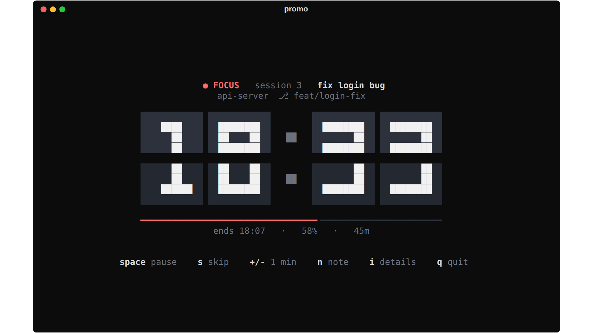
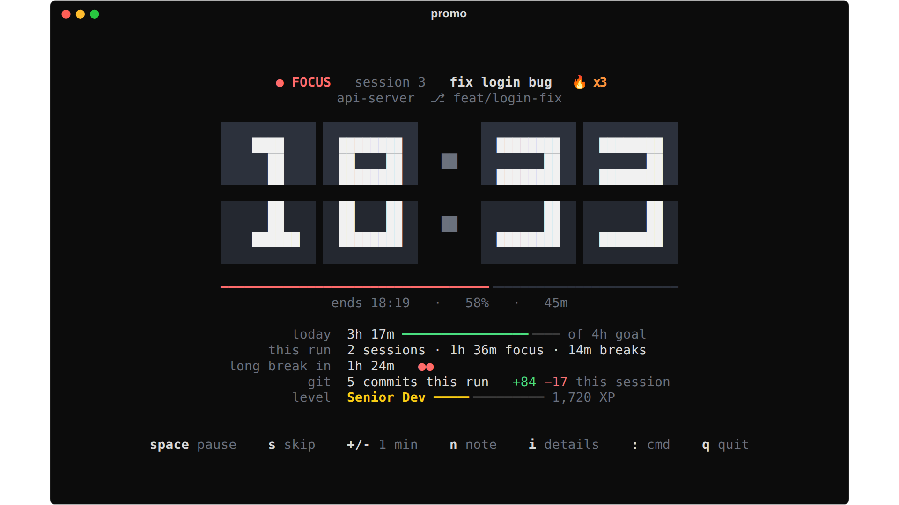
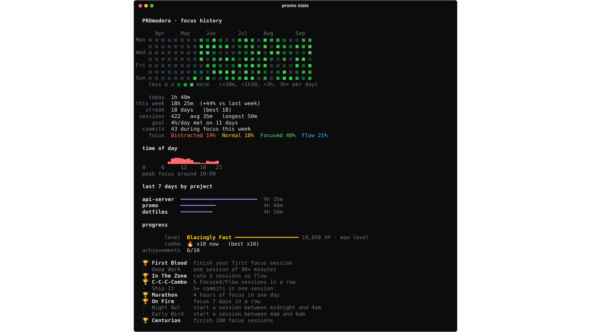
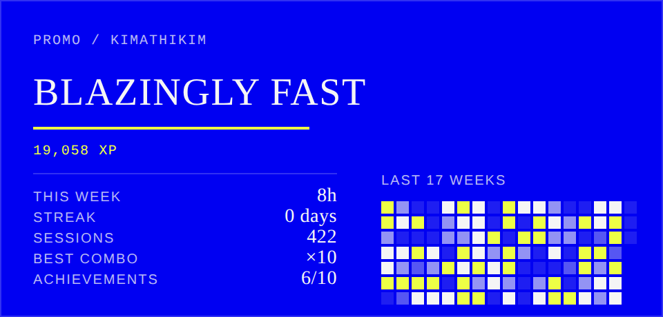
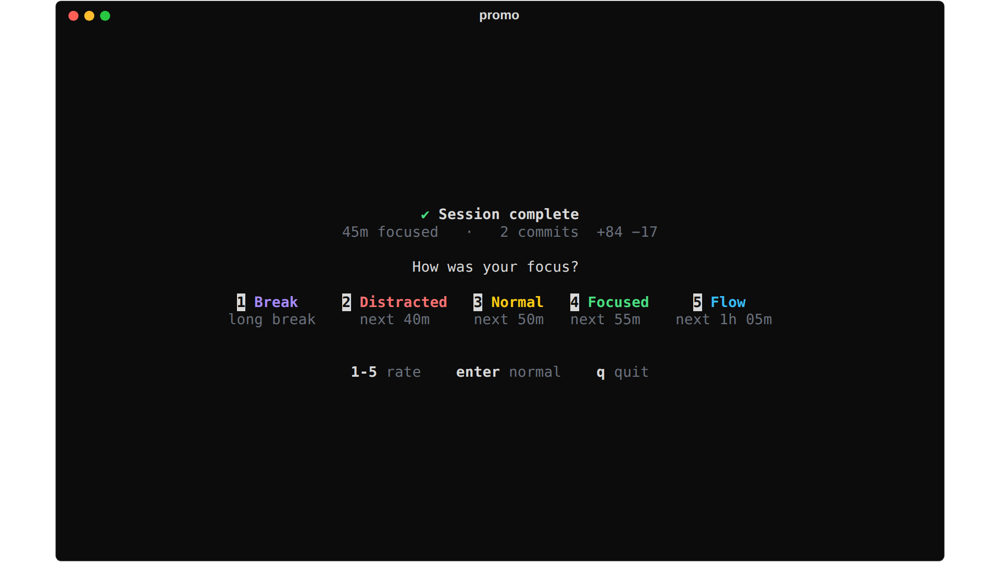

# PROmodoro — a progressive Pomodoro timer for developers



PROmodoro is a distraction-free terminal timer built around the Pomodoro Technique, with one twist: session length isn't fixed. After every session you rate how focused you were and the next one grows or shrinks, so short attention spans can build up into long flow states.

It's made for people who live in the terminal: it knows which git repo and branch you're in, counts the commits you make while focused, lets you jot down a stray thought without leaving the timer, and plugs into tmux, waybar and your own scripts.

***For better grasp of the idea***

[00:00](https://www.youtube.com/watch?v=qtoysJSQTn8&t)

## Features

**A clean, flip-clock style screen**
- Big flip-card digits that animate as they change, a slim progress bar, and nothing else on screen until you ask for it.
- Press `i` for details: today's total against your daily goal, this run's sessions, time left until the long break, and git activity.
- The countdown also appears in your terminal tab title.

**Progressive sessions**
- After each focus session you rate your focus, and the next session is resized (see [Workflow](#workflow)).
- Breaks are one fifth of the time you *actually* focused. A 30-minute long break comes after 3 hours of focus.

**Built for developers**
- **Git context**: shows the repo and branch you're working in and logs them with every session.
- **Commit capture**: counts the commits and lines changed during each focus session (only your own, matched by `git config user.email`).
- **Quick notes**: press `n`, type a thought ("check null user in middleware"), press `enter`, and you're back to work. Notes go to a Markdown checklist with the time, repo and task.
- **`promo stats`**: a GitHub-style focus heatmap, streaks, week-over-week trend, a focus-level breakdown, your peak hour of the day, and time per project.
- **`promo status`**: a one-line status for tmux, waybar, polybar or your shell prompt.
- **Hooks**: run your own command when a session starts or ends, e.g. to turn on Do Not Disturb or set your Slack status.
- **Sound**: a chime when focus ends, a different one when your break is over, and a soft one for kudos. Swap in your own files if you like. There are also desktop notifications (`notify-send` on Linux, `osascript` on macOS) and the terminal bell.

**Never leave the keyboard**
- **Remote control**: `promo toggle`, `promo skip`, `promo add 10`, `promo note "..."` work from any shell, so you can bind them in tmux or your window manager. Commands reach the timer instantly.
- **Neovim plugin**: the timer in your statusline, `:Promo` commands, and `:PromoNote` to jot down the current `file:line` without leaving the buffer.
- **Vim-style controls**: `:` opens a command line (`:q`, `:add 10`, `:task fix auth`), and unknown commands get a proper `E492`. Pick your rating with `h`/`l` + `enter`.

**A little game**
- Earn XP for focused minutes (Flow pays best) and climb from *Intern* to *Blazingly Fast*.
- Rate Focused or Flow in a row to build a 🔥 combo that boosts your XP.
- Unlock achievements like *Deep Work*, *C-C-C-Combo*, *Ship It* and *Night Owl*.
- Optional `--spicy` mode adds commentary: "45m and 0 commits… skill issue?", "go touch grass 🌱".

**Focus with your squad**
- See who's focusing right now, right under your clock: `👥 alice 🍅 12m · bob ☕ 3m`.
- A squad leaderboard (today, week, streak, level) in the details view, in `promo squad`, and on a web dashboard.
- A live feed of finished sessions, level-ups and achievements, plus 🔥 kudos. It's all held until your break, so nothing interrupts focus.
- `promo join alice`: sync your timer to a teammate's session and focus together.
- `promo card`: an SVG stats card for your GitHub profile README.
- Self-hosted with zero dependencies: one person runs `promo serve` and everyone else adds one line to their config.



## Usage

```sh
promo [hours] [minutes] [task]
```

```sh
promo                         # 5-minute warm-up session
promo 25                      # one number = minutes
promo 1 30                    # 1h30
promo 25 fix login bug        # with a task label
promo -t "review PR #42" 45
```

| Key | Action |
|---|---|
| `space` / `p` | pause / resume |
| `s` | skip the current phase |
| `+` / `-` | add / remove a minute |
| `n` | capture a note (`enter` saves, `esc` cancels) |
| `i` | show / hide details |
| `:` | command line: `:q`, `:add 10`, `:-5`, `:task fix auth`, `:note ...`, `:skip` |
| `q` / `Ctrl-C` | quit and show the summary |
| `h` / `l`, `enter` | on the rating screen: move and pick (or press `1`–`5`) |

### Stats

```sh
promo stats            # last 26 weeks
promo stats --weeks 52
```



### Status bar integration

`promo status` prints the running timer (for example `🍅 18:33`), and nothing when no timer is running.

```sh
# tmux (~/.tmux.conf)
set -g status-right '#(promo status) %H:%M'
set -g status-interval 1

# waybar module
"custom/promo": { "exec": "promo status --json", "return-type": "json", "interval": 1 }

# custom format; placeholders: {icon} {time} {phase} {task} {project} {branch} {session} {combo}
promo status --format "{icon} {time} {combo}"
```

### Remote control

While a timer is running, any shell can drive it:

```sh
promo toggle            # pause / resume   (also: pause, resume)
promo skip              # end the current phase
promo add 10            # +10 minutes      (sub 5 for −5)
promo task "fix auth"   # change the task label
promo note "check token expiry"   # works even with no timer running
promo rate 4            # answer the rating screen
promo stop              # quit and log what you did
```

Only one timer runs at a time; starting a second one tells you how to control the first.

### tmux

Run the timer in its own window and control it from anywhere:

```tmux
# ~/.tmux.conf
bind-key P new-window -d -n promo 'promo'           # start it in the background
bind-key p run-shell -b 'promo toggle'               # prefix p: pause / resume
bind-key N command-prompt -p 'note:' "run-shell -b 'promo note \"%%\"'"
set -g status-right '#(promo status) %H:%M'
set -g status-interval 1
```

### Neovim

The plugin lives in this repo (`lua/promo`). With [lazy.nvim](https://github.com/folke/lazy.nvim):

```lua
{
  "kimathikim/promo",
  config = function()
    require("promo").setup({ keymaps = true })
  end,
}
```

```lua
-- lualine
sections = { lualine_x = { require("promo").statusline } }
```

| Command | Action |
|---|---|
| `:Promo` / `:Promo open [min] [task]` | open or hide the timer in a floating terminal (`<C-q>` hides it; the timer keeps running) |
| `:Promo toggle`, `skip`, `stop`, `add 10`, `task ...`, `rate 4` | control the timer |
| `:PromoNote [text]` | save a note; with no text it captures `file:line` and the current line |

With `keymaps = true`: `<leader>po` open/hide, `<leader>pp` pause/resume, `<leader>ps` skip, `<leader>pn` note at cursor, `<leader>pa` add 5 minutes.

### XP, levels and achievements

Each focus session earns XP: minutes × your focus rating (Distracted 0.5×, Normal 1×, Focused 1.25×, Flow 1.5×), plus 10% per combo step (up to 50%). Levels run *Intern → Junior Dev → Mid-level Dev → Senior Dev → Staff Engineer → Principal Engineer → Distinguished Engineer → 10x Engineer → Blazingly Fast*. Everything is computed from your session log, so nothing extra is stored. `promo stats` shows your level, best combo and achievements; `--no-game` hides it all.

### Hooks

`--hook CMD` (or `hook =` in the config file) runs a shell command on each of these events: `focus_start`, `focus_end`, `break_start`, `break_end`, `pause`, `resume` and `quit`. It gets the environment variables `PROMO_EVENT`, `PROMO_PHASE`, `PROMO_MINUTES`, `PROMO_TASK`, `PROMO_PROJECT` and `PROMO_BRANCH`.

```sh
#!/bin/sh
# ~/bin/promo-dnd: silence notifications while focusing (dunst)
case "$PROMO_EVENT" in
  focus_start|resume) dunstctl set-paused true ;;
  *)                  dunstctl set-paused false ;;
esac
```

### Squad

**1. Someone runs a server** on any machine the squad can reach: a small VPS, a Raspberry Pi, or a laptop on [Tailscale](https://tailscale.com/).

```sh
promo serve --host 0.0.0.0 --port 8787 --token "$(openssl rand -hex 16)"
```

A server can hold any number of rooms. A room is created the first time someone joins it.

**2. Everyone adds the room** to `~/.config/promo/config.ini`:

```ini
[promo]
squad = http://your-server:8787/r/night-shift
squad_token = <the token>
squad_name = alice        ; defaults to your git user.name
share_task = false        ; true shares your task and repo name with the squad
```

**3. Use it**

```sh
promo                       # your timer now shows who else is focusing
promo squad                 # leaderboard + feed   (--watch to keep it live)
promo join alice            # focus with alice: your session ends when hers does
promo kudos bob             # send bob a 🔥 (he sees it on his next break)
promo card -o promo.svg     # stats card for your README
```

Inside the timer, `:kudos bob` sends kudos, and `i` shows the squad leaderboard. The web dashboard is at `http://your-server:8787/r/night-shift?key=<token>`. It auto-refreshes, so it works well on a spare screen.

**What gets shared:**
- Your name, your current phase and time left.
- Today's and this week's focus minutes, streak, XP, level and best combo.
- Events: finished sessions, achievements, level-ups and kudos.

Your task and repo name are shared only with `share_task = true`. Notes, commit messages and file names never leave your machine. The server is plain HTTP, so put it behind HTTPS (Caddy, nginx) or a private network like Tailscale if it's reachable from the internet. Stats are self-reported, so squads work best with people you trust.



### Sound

Every phase ends with a chime, played by an audio player you already have (`pw-play`, `paplay`, `aplay` or `ffplay` on Linux, `afplay` on macOS, built in on Windows). The chimes are generated on first use, so there's nothing to download.

```sh
promo sound               # preview every sound and see which player is used
promo sound focus_end     # just one: focus_end, break_end, long_break_end, kudos
promo --no-sound          # silent run
```

```ini
[promo]
volume = 0.7                          ; 0 to 1
sound_repeat = 2                      ; ring the end-of-phase chime twice
sound_focus_end = ~/sounds/gong.ogg   ; your own file for any sound
sound = false                         ; turn chimes off
```

### Config file

Defaults can be set in `~/.config/promo/config.ini`; command-line flags override them.

```ini
[promo]
minutes = 25              ; first session length
goal = 240                ; daily focus goal in minutes (0 = off)
long_break_after = 180
hook = ~/bin/promo-dnd
bell = true
sound = true              ; chimes (see Sound above)
volume = 0.7
git = true
title = true
game = true               ; XP, levels, combos, achievements
spicy = false             ; commentary with attitude
status_format = {icon} {time}
```

## Workflow

1. A focus session starts with the length you gave.
2. When it ends (or you skip it), rate your focus:

   

   | Key | Level      | Next focus session  |
   |-----|------------|---------------------|
   | 1   | Break      | long break (30 min) |
   | 2   | Distracted | −5 minutes          |
   | 3   | Normal     | +5 minutes (`enter`)|
   | 4   | Focused    | +10 minutes         |
   | 5   | Flow       | +20 minutes         |

   Sessions stay between 5 minutes and 3 hours.
3. A short break of one fifth of the focused time follows, or a long break when one is due.
4. The cycle repeats until you press `q` or `Ctrl-C`. A phase you stop partway through is still logged if it ran for at least 30 seconds.

## Data

| File | Contents |
|---|---|
| `~/.local/share/promo/sessions.csv` | one row per phase: `date, start, end, phase, planned_min, actual_min, focus_level, task, project, branch, commits` |
| `~/.local/share/promo/notes.md` | notes captured with `n` |
| `~/.cache/promo/state.json` | the running timer, read by `promo status` and the Neovim plugin |
| `~/.cache/promo/control` | named pipe the running timer listens on for remote commands |
| `~/.local/share/promo/squad.json` | rooms and feeds, on the machine running `promo serve` |

`XDG_DATA_HOME`, `XDG_CACHE_HOME` and `XDG_CONFIG_HOME` are respected. Use `--log` / `--notes` to use other paths.

## Installation

Requires Python 3.7+ and [`rich`](https://github.com/Textualize/rich). The Neovim plugin needs Neovim 0.8+. Keyboard controls need a Unix-like terminal (Linux or macOS). A terminal with true colour and a font that has block characters looks best.

```sh
git clone https://github.com/kimathikim/promo.git ~/promo
cd ~/promo
pip install -r requirements.txt
sudo cp promo.py /usr/local/bin/promo
sudo chmod +x /usr/local/bin/promo
```

## Contributing

Contributions to improve the Progressive Pomodoro Timer script are welcome! If you find any issues or have suggestions for enhancements, please create a new issue or submit a pull request on the repository.
